# Visual Walkthroughs

These visuals are aimed at readers with classical-software background: think of
each algorithm as a dataflow pipeline with state snapshots.

## Grover (High-Level Dataflow)

### Snapshot intuition (n=2, one target)

- Start (`H` on both): each of 4 states has probability `0.25`
- After 1 Grover round: target approaches probability `~1.0`

## Bernstein-Vazirani (Pipeline)

```mermaid
flowchart LR
  A["Prepare input superposition"] --> B["Apply linear oracle f(x)=s·x xor b"]
  B --> C["Hadamard decode on input register"]
  C --> D["Measure input bits = secret s"]
```

### Snapshot intuition

- Before decode: secret is hidden in phase pattern
- After decode: phase pattern maps to one classical basis index

## Deutsch-Jozsa (Pipeline)

### Snapshot intuition

- Constant oracle aligns phases so `|00...0>` remains
- Balanced oracle creates cancellation at `|00...0>`
